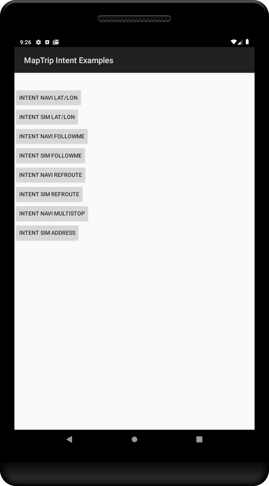

# MapTrip Android Intent Examples #

The MapTrip intent interface for Android is available since MapTrip 4.1 and offers extended possibilities when starting [MapTrip](https://maptrip.de). The purpose of this project is to provide examples how to start different types of route guidance in MapTrip from your own application.
This also means that more control options are also available in WebApps. Especially routes (like [FollowMe](https://www.maptrip.de/followme) or Reference routes) can be started easily.



## Requirements ##

In order to benefit from this sample application you will need to have a working version of MapTrip on your device. In case you do not have MapTrip yet, do not hesitate to [contact us](https://www.infoware.de/en/contact-us/).

## Calling the MapTrip Intent from JAVA ##
```
Intent intent = new Intent(Intent.ACTION_VIEW, Uri.parse("maptrip://navigate?latitude=50.738912&longitude=7.106772"));
startActivity(intent);
```

## Start of a navigation with a WGS84 coordinate ##
*maptrip://navigate?latitude=50.738912&longitude=7.106772*
## Start of a navigation with an address ##
*maptrip://navigate?country=DEU&city=Bonn&zip=53175&street=Riemenschneiderstr&houseno=11*

The abbreviation of street names (e.g. Riemenschneiderstr) is possible. The dot at the end of the word must not be set. It is possible to omit the postal code. However, it is not guaranteed which coordinates the system will use if the address exists multiple times in the area. Typically, this applies to streets such as *Hauptstraße* or *Bahnhofstraße* in larger cities in Germany. The country code is given according to *ISO 31-66-1 Alpha-3*, i.e. with three capital letters.
## Start of a simulation ##
Each navigation can also be simulated by using *simulate* instead of *navigate*, e.g.:

*maptrip://simulate?latitude=50.738912&longitude=7.106772*
## Start of a route ##
*maptrip://navigate?route=<path_url_encoded>&type=*

possible types: refroute, followme, maptrip
### Parameter route: ###
The absolute path (URL encoded) must be passed to the file.
### Parameter type: ###
Type of the route file. The following parameters are possible:
-	refroute    -  for a Reference route
-	followme   -  for a FollowMe route
-	maptrip   -   for a MapTrip tour file (XML)

Please find example route files within the *intent_example_data* folder of this project.
## Start of a multi-stopp navigation (up to 10 intermediate destinations) ##
*maptrip://navigate?posx0=50.2374&posy0=7.123423&posx1=50.2374&posy1=7.123423..&posx9=50.2374&posy9=7.123423*

## Start navigation from HTTP URL ##
It is also possible to start a navigation via an HTTP URL, e.g. for launching MapTrip from a Website or SMS.

*http://maptrip.de/navigate?latitude=50.738912&longitude=7.106772*
